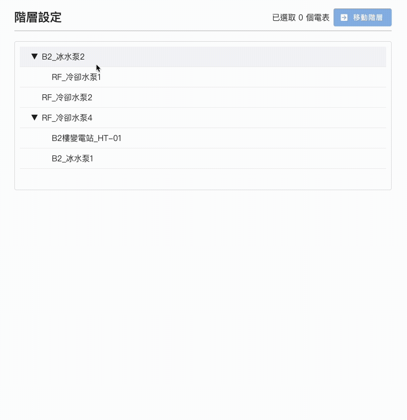
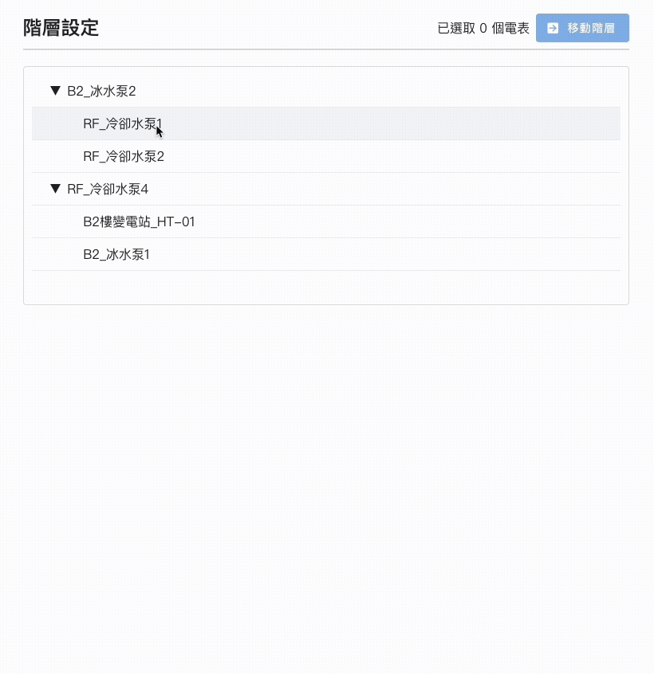
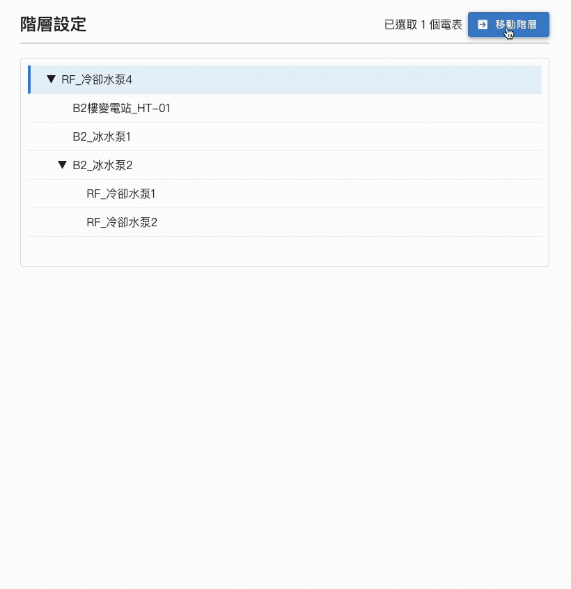

# 電表階層管理系統

此專案可執行電表階層管理系統操作。

## 安裝與啟動

```bash
npm install
npm run dev
#服務在 http://localhost:5173/
```

## 操作說明

#### 選取設備，點選移動階層按鈕，選取父電表可移動至該父電表之下。

> 

#### 按住 alt, meta key 或 ctrl 可多選，但不可跨階層選取。

> 

#### 移動限制

1. 不可移動到與原本相同的父層。
2. 不可將電表移動到自身或其子孫節點底下。

   > 
